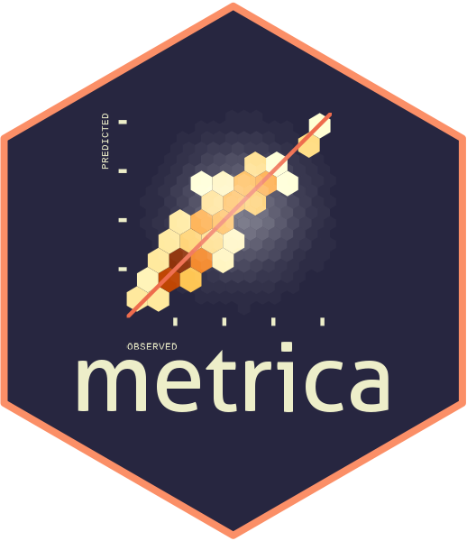
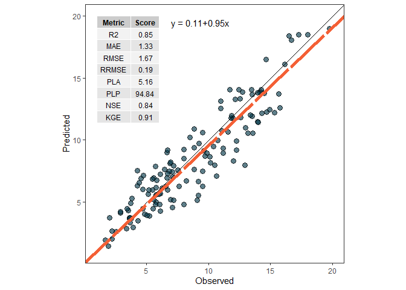

# Summary 

{ width=15% align=left}

The `metrica` R-package [@metrica_manual] is an open-source software designed to facilitate the quantitative and visual assessment of prediction performance of point-forecast simulation models for continuous (regression) and categorical variables (classification). The package assembles a series of more than 80 functions that account for multiple aspects of the agreement between predicted and observed values. Without the need of advanced skills on programming, `metrica` enables users to automate the estimation of multiple prediction performance metrics including goodness of fit, error metrics, error decomposition, model efficiency, indices of agreement, and to produce stylish data visualization outputs. This article introduces the `metrica` R-package, developed with the main objective of contributing to reproducible evaluation of point-forecast models performance.

# Statement of need

Evaluating the prediction quality is a crucial step for any simulation model, for which a myriad of metrics and visualization techniques have been developed [@Tedeschi_2006; @Yang_2014; @Wallach_etal_2019]. Nonetheless, to conduct a comprehensive assessment of the predicted-observed agreement in R [@R_Core_Team], users normally have to rely on multiple packages, and even on self-defined functions, which increases the risk of involuntary mistakes due to the need of fluctuating syntax and data wrangling.

As the reproducibility of data analysis continues to be a challenge for science [@Seibold_2022], the development of open source software like `metrica` represent a step-forward toward transparent and reproducible process to assist researchers on evaluating models performance. We specifically decided to create `metrica` in R software [@R_Core_Team] due to its substantial role in data science [@Thiem_2018]. Under the open-source philosophy, R hosts cutting-edge algorithms that combined with an infrastructure like the Comprehensive R Archive Network (CRAN) -enhancing global dissemination-, clearly empowers the democratization of statistical computing [@Hackenberger_2020].

Finally, it is noteworthy that in the area of agricultural sciences, although point-forecast simulation models such as the Agricultural Production Systems sIMulator (APSIM) [@APSIM_classic; @APSIM_nextgen] count with tools to facilitate the integration into R through packages such as apsimx [@apsimx_manual], the assessment of their prediction quality is not yet integrated for R users. Therefore, we aim `metrica` to offer users of agricultural simulation models a toolbox for assessing the simulation performance.

# Package features

For regression models, it includes 4 plotting functions (scatter, tiles, density, & Bland-Altman plots), and 48 prediction performance scores. For classification models (two-class or multi-class), `metrica` includes a function to visualize the confusion matrix using ggplot2 [@ggplot_book], and 27 functions of prediction scores. The full list of regression and classification performance metrics, along with their corresponding description, formula, and literature sources, is presented in the package documentation at: 

- Regression metrics: https://adriancorrendo.github.io/metrica/articles/available_metrics_regression.html.

- Classification metrics: https://adriancorrendo.github.io/metrica/articles/available_metrics_classification.html.

To extent of our knowledge, `metrica` provides unique features not supported (or partially supported) by other similar R packages [@yardstick_manual; @mlr3_paper; @Metrics_manual; @hydroGOF_manual; @cvms_package; @performance_paper] designed for model evaluation such as:

- work under both vectorized (calling variables with $) or data.frame forms (using data argument).

- store results as a list (`tidy = FALSE`) or as a table (`tidy = TRUE`).

- for classification, functions automatically recognize two-class or multi-class data; and specifically for multi-class models, metrics can be estimated for each class (`atom = TRUE`).

- the implementation of a symmetric linear regression (standardized major axis-SMA-, [@Warton_2006]) to describe: i) the pattern of the bivariate relationship with linear parameters (`B0_sma`, `B1_sma`), and ii) the degree of predicted-observed agreement by using the SMA-line to decompose the mean-squared-error (MSE) into lack of accuracy (`MLA`, `PLA`, `RMLA`) and lack of precision (`MLP`, `PLP`, `RMLP`) components [@CORRENDO2021_AgSyst]. 

- alternative MSE decomposition approaches such as the ones described by [@Kobayashi_Salam_2000] (`SB`, `SDSD`, `LCS`), and by [@Smith_Rose_1995] (`Ub`, `Uc`, `Ue`).

- the estimation of multiple indices of agreement and model efficiencies at their alternative versions such as: i) the index of agreement `d` [@Willmott_1981], and its modified `d1` [@Willmott_etal_1985] and refined `d1r` [@Willmott_etal_2012] variants, ii) the Nash–Sutcliffe model efficiency (`NSE`) [@Nash_1970] and its improved variants `E1` [@Legates_1999], `Erel` [@Krause_2005], and Kling-Gupta model efficiency (`KGE`) [@Kling_etal_2012], iii) the Robinson's index of agreement (RAC) [@Robinson_1957; @Robinson_1959], iv) the Ji & Gallo agreement coefficient (AC) [@Ji_Gallo_2006], v) the Duvellier's `lambda` [@Duveiller_2016], vi) the distance correlation (`dcorr`) [@Szekely_2007], or vii) the maximal information coefficient (`MIC`) [@Reshef_2011]), among others.

- easily import files from APSIM Classic with `import_apsim_out()`), and APSIM Next Generation with `import_apsim_db()`.

# Usage

## System requirements and installation

The `metrica` package operates within the R environment, the first step is to install R (version 4.2.0 or higher). We encourage users to install the latest version RStudio desktop [@RStudio_manual], a free and user-friendly environment that facilitates operations in R.

To install the latest stable version (CRAN mirror) of the `metrica` package, users just need to run the following line:

```
install.packages("metrica")

```

To install the latest development version (GitHub repository) of the metrica package, users need to run the following line:

```
devtools::install_github("adriancorrendo/metrica")

```

To load the package, users simply need to type:

```
library(metrica)

```

## Using the functions

There are two basic arguments common to all `metrica` functions: (i) `obs`(Oi; observed, a.k.a. actual, measured, truth, target, label), and (ii) `pred` (Pi; predicted, a.k.a. simulated, fitted, modeled, estimate) values. Optional arguments include `data` that allows to call an existing data frame containing both observed and predicted vectors, and `tidy`, which controls the type of output as a list (tidy = FALSE) or as a data.frame (tidy = TRUE).

For regression, some specific functions also require defining the axis `orientation`. For example, the slope of the symmetric linear regression describing the bivariate scatter (SMA). For binary classification (two classes), functions also require to check the `pos_level` arg., which indicates the alphanumeric order of the “positive level”. Normally, the most common binary denominations are c(0,1), c(“Negative”, “Positive”), c(“FALSE”, “TRUE”), so the default pos_level = 2 (1, “Positive”, “TRUE”). However, other cases are also possible, such as c(“Crop”, “NoCrop”) for which the user needs to specify pos_level = 1.

For multi-class classification tasks, some functions present the `atom` arg. (logical TRUE / FALSE), which controls the output to be an overall average estimate across all classes, or a class-wise estimate. For example, user might be interested in obtaining estimates of precision and recall for each possible class of the prediction.

## Example 1: Regression (continuous variables)

The following line of code calls a `data.frame` called `wheat`, contained by `metrica` as part of the native datasets.

```r
data_wheat <- metrica::wheat
```

Users can specifies a vector with a few classification metrics of interest, which can be passed within the `metrics_summary()` function as follows:

```r
my_reg_metrics <- c("RMSE", "MAE", "KGE", "d", "PLP", "PLA")
metrics_summary(data = data_wheat, type = "regression", metrics_list = my_reg_metrics)
```

### Table 1: Regression metrics summary.

| Metric | Score |
|---|---|
| RMSE | 0.90 |
| MAE | 0.90 |
| KGE | 0.90 |
| d | 0.90 |
| PLP | 0.90 |
| PLA | 0.90 |

To produce a classical scatter plot users may use:

```r
scatter_plot(data = data_wheat, 
             obs = obs , pred = pred,
             print_metrics = TRUE, 
             metrics_list = my_reg_metrics)
```

 

### Classification (categorical variables)

The following line of code calls a `data.frame` called `maize_phenology`, one of the native datasets of `metrica` for classification.

```r
data_multiclass <- metrica::maize_phenology
```

```r
recall(data = data_multiclass, obs = , pred = , atom = TRUE)
```

```r
my_class_metrics <- c("accuracy", "precision", "recall")
metrics_summary(data = data_multiclass, 
                obs = actual, pred = predicted,
                type = "classification")
```

To produce a classical confusion matrix plot users may use:

```r
confusion_matrix(data = data_multiclass,
                 obs = actual, pred = predicted, 
                 plot = TRUE, 
                 colors = c(low="grey85" , high="steelblue") )
```

 

### Table 1: Classification metrics summary.

| Metric | Score |
|---|---|
| accuracy | 0.90 |
| precision | 0.90 |
| recall | 0.90 |

# APSIM files

The metrica package was developed to assess the prediction performance of, among other, crop simulation models such as APSIM. In order to import files from simulation models like APSIM Classic (*.out files), users can implement:

```r
metrica::import_apsim_out(filepath = "../*.out")
```
To import files from the APSIM Next Generation (SQL, *.db files), users can use the following lines of code:

```r
metrica::import_apsim_db(filename = "*.db", folder = "../folder/")
```

# Acknowledgements

We acknowledge contributions from #### during the genesis of this project.

# License

`metrica` is under MIT License.

# References
